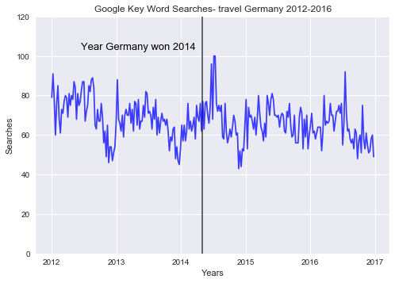
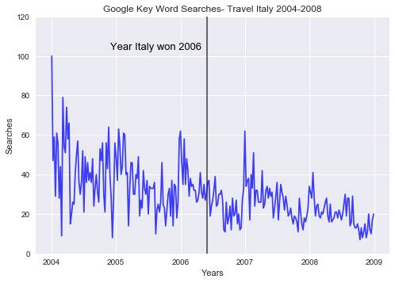
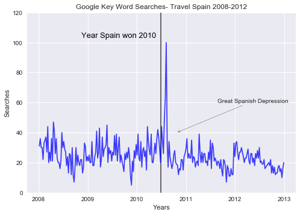
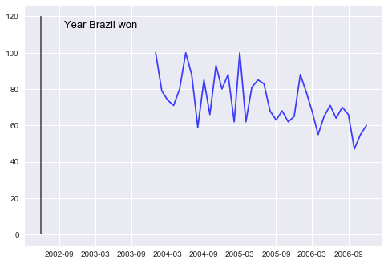
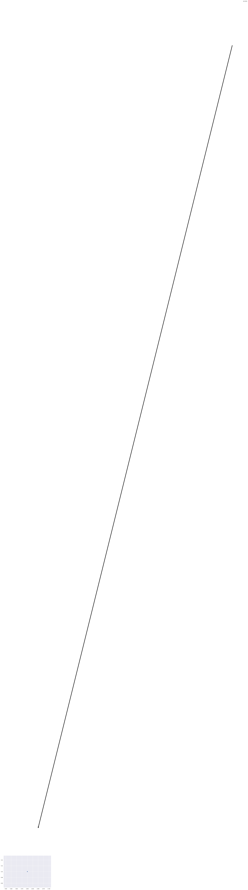

```python
from pytrends.request import TrendReq
import matplotlib.pyplot as plt
import pandas as pd
import datetime

# Login to Google. Only need to run this once, the rest of requests will use the same session.
pytrends = TrendReq(hl='en-US', tz=360)

```


```python
#kw_list = ["Germany vacation"]
kw_list = ["travel Germany"]
pytrends.build_payload(kw_list, cat=0, timeframe='2012-01-01 2016-12-31', geo='', gprop='')

germany=pytrends.interest_over_time()
germany=germany.drop("isPartial", axis=1)

#plt.axvline(x=2012, ymin=0, ymax = 100, linewidth=1, color='grey')
plt.vlines(datetime.datetime(2014, 5, 1), 0, 120, alpha=0.75, linewidth=1.5)
plt.plot(germany, color='blue',alpha=0.75)

# insert label 
plt.text(0.23, 0.81, 'Year Germany won 2014',
        verticalalignment='bottom', horizontalalignment='center',
        transform=ax.transAxes,
        color='black', fontsize=13)

# Adjust Y-axis
plt.ylim(0, 120)

#Add labeling
plt.title("Google Key Word Searches- travel Germany 2012-2016")
plt.xlabel("Years")
plt.ylabel("Searches")

# Customize the grid
plt.style.use('seaborn')
```





```python
#kw_list = ["travel Italy"]
kw_list = ["Italy vacation"]
pytrends.build_payload(kw_list, cat=0, timeframe='2004-01-01 2008-12-31', geo='', gprop='')

italy=pytrends.interest_over_time()
italy=italy.drop("isPartial", axis=1)

plt.vlines(datetime.datetime(2006, 6, 1), 0, 120, alpha=0.75, linewidth=1.5)
plt.plot(italy, color='blue',alpha=0.75)


# insert label 
plt.text(0.28, 0.81, 'Year Italy won 2006',
        verticalalignment='bottom', horizontalalignment='center',
        transform=ax.transAxes,
        color='black', fontsize=13)

# Adjust Y-axis
plt.ylim(0, 120)

#Add labeling
plt.title("Google Key Word Searches- Travel Italy 2004-2008")
plt.xlabel("Years")
plt.ylabel("Searches")

# Customize the grid
plt.style.use('seaborn')

```





```python
kw_list = ["Spain vacation"]

pytrends.build_payload(kw_list, cat=0, timeframe='2008-01-01 2012-12-31', geo='', gprop='')

spain=pytrends.interest_over_time()
spain=spain.drop("isPartial", axis=1)


plt.vlines(datetime.datetime(2010, 7, 1), 0, 120, alpha=0.75, linewidth=1.5)
plt.plot(spain, color='blue',alpha=0.75)

# insert label 
plt.text(0.28, 0.81, 'Year Spain won 2010',
        verticalalignment='bottom', horizontalalignment='center',
        transform=ax.transAxes,
        color='black', fontsize=13)

# Add arrow
plt.annotate('Great Spanish Depression', xy=('2010-10-25', 40), xytext=('2011-08-25', 60),
            arrowprops=dict(arrowstyle="->",facecolor='black'))

# Adjust Y-axis
plt.ylim(0, 120)

#Add labeling
plt.title("Google Key Word Searches- Travel Spain 2008-2012")
plt.xlabel("Years")
plt.ylabel("Searches")

# Customize the grid
plt.style.use('seaborn')
```





```python

kw_list = ["Brazil travel"]
pytrends.build_payload(kw_list, cat=0, timeframe='2000-01-01 2006-12-31', geo='', gprop='')

italy=pytrends.interest_over_time()
italy=italy.drop("isPartial", axis=1)

plt.vlines(datetime.datetime(2002, 6, 1), 0, 120, alpha=0.75, linewidth=1.5)
plt.plot(italy, color='blue',alpha=0.75)


# insert label 
plt.text(0.12, 0.81, 'Year Brazil won',
        verticalalignment='bottom', horizontalalignment='center',
        transform=ax.transAxes,
        color='black', fontsize=13)

plt.text('2012-1-1', 3950, "New Year's Day", **style)

plt.ylim(0, 120)

plt.title("Google Key Word Searches- Brazil 2002-2006")
plt.xlabel("Years")
plt.ylabel("Searches")

# Customize the grid
plt.style.use('seaborn')

```


    ---------------------------------------------------------------------------

    NameError                                 Traceback (most recent call last)

    <ipython-input-230-ab5946eed717> in <module>()
         16         color='black', fontsize=13)
         17 
    ---> 18 plt.text('2012-1-1', 3950, "New Year's Day", **style)
         19 
         20 plt.ylim(0, 120)


    NameError: name 'style' is not defined





```python
plt.plot([2], [1], 'o')
plt.annotate('annotate', xy=(2, 1), xytext=(3, 4),
            arrowprops=dict(facecolor='black', shrink=0.05))
```


    Text(3,4,'annotate')




