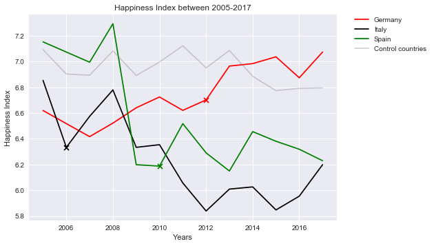

```python
import matplotlib.pyplot as plt
import pandas as pd
import numpy as np
```


```python
# Read World Happiness Report into pandas
whr = "Data/WHRv2.csv"
whr_df = pd.read_csv(whr)

whr_df.head()
```


<div>
<style scoped>
    .dataframe tbody tr th:only-of-type {
        vertical-align: middle;
    }

    .dataframe tbody tr th {
        vertical-align: top;
    }

    .dataframe thead th {
        text-align: right;
    }
</style>
<table border="1" class="dataframe">
  <thead>
    <tr style="text-align: right;">
      <th></th>
      <th>GDP Rank</th>
      <th>country</th>
      <th>year</th>
      <th># of Missing Datapoints</th>
      <th>Life Ladder With Gaps</th>
      <th>Consecutive Missing</th>
      <th>New Value</th>
      <th>Life Ladder</th>
    </tr>
  </thead>
  <tbody>
    <tr>
      <th>0</th>
      <td>1</td>
      <td>United States</td>
      <td>2005</td>
      <td>1</td>
      <td>0.000</td>
      <td>NaN</td>
      <td>7.182</td>
      <td>7.182</td>
    </tr>
    <tr>
      <th>1</th>
      <td>1</td>
      <td>United States</td>
      <td>2006</td>
      <td>1</td>
      <td>7.182</td>
      <td>0.0</td>
      <td>NaN</td>
      <td>7.182</td>
    </tr>
    <tr>
      <th>2</th>
      <td>1</td>
      <td>United States</td>
      <td>2007</td>
      <td>1</td>
      <td>7.513</td>
      <td>0.0</td>
      <td>NaN</td>
      <td>7.513</td>
    </tr>
    <tr>
      <th>3</th>
      <td>1</td>
      <td>United States</td>
      <td>2008</td>
      <td>1</td>
      <td>7.280</td>
      <td>0.0</td>
      <td>NaN</td>
      <td>7.280</td>
    </tr>
    <tr>
      <th>4</th>
      <td>1</td>
      <td>United States</td>
      <td>2009</td>
      <td>1</td>
      <td>7.158</td>
      <td>0.0</td>
      <td>NaN</td>
      <td>7.158</td>
    </tr>
  </tbody>
</table>
</div>


```python
# Create dataframe for each country
whr_Germany_df = whr_df.loc[whr_df["country"] == "Germany"]
whr_Italy_df = whr_df.loc[whr_df["country"] == "Italy"]
whr_Spain_df = whr_df.loc[whr_df["country"] == "Spain"]

# create on dataframe for control countries
#whr_Control_df = whr_df.loc[(whr_df["country"] == "Belgium") | (whr_df["country"] == "UK") | (whr_df["country"] == "France") | (whr_df["country"] == "Sweden") | (whr_df["country"] == "Brazil") ]
whr_df_Control_df = whr_df.loc[whr_df["country"].isin(['Australia','Canada','China','France','India','Indonesia','Japan','Korea, Rep.','Mexico','Netherlands','Russian Federation','Saudi Arabia','Switzerland','Turkey','United Kingdom','United States'])]

# find mean for those control countries
grouped=whr_Control_df.groupby("year")
summed=grouped["Life Ladder"].mean()
summed

whr_Control_df.head()
```


<div>
<style scoped>
    .dataframe tbody tr th:only-of-type {
        vertical-align: middle;
    }

    .dataframe tbody tr th {
        vertical-align: top;
    }

    .dataframe thead th {
        text-align: right;
    }
</style>
<table border="1" class="dataframe">
  <thead>
    <tr style="text-align: right;">
      <th></th>
      <th>GDP Rank</th>
      <th>country</th>
      <th>year</th>
      <th># of Missing Datapoints</th>
      <th>Life Ladder With Gaps</th>
      <th>Consecutive Missing</th>
      <th>New Value</th>
      <th>Life Ladder</th>
    </tr>
  </thead>
  <tbody>
    <tr>
      <th>65</th>
      <td>6</td>
      <td>France</td>
      <td>2005</td>
      <td>1</td>
      <td>7.093</td>
      <td>0.0</td>
      <td>NaN</td>
      <td>7.093</td>
    </tr>
    <tr>
      <th>66</th>
      <td>6</td>
      <td>France</td>
      <td>2006</td>
      <td>1</td>
      <td>6.583</td>
      <td>0.0</td>
      <td>NaN</td>
      <td>6.583</td>
    </tr>
    <tr>
      <th>67</th>
      <td>6</td>
      <td>France</td>
      <td>2007</td>
      <td>1</td>
      <td>0.000</td>
      <td>1.0</td>
      <td>6.795</td>
      <td>6.795</td>
    </tr>
    <tr>
      <th>68</th>
      <td>6</td>
      <td>France</td>
      <td>2008</td>
      <td>1</td>
      <td>7.008</td>
      <td>0.0</td>
      <td>NaN</td>
      <td>7.008</td>
    </tr>
    <tr>
      <th>69</th>
      <td>6</td>
      <td>France</td>
      <td>2009</td>
      <td>1</td>
      <td>6.283</td>
      <td>0.0</td>
      <td>NaN</td>
      <td>6.283</td>
    </tr>
  </tbody>
</table>
</div>


```python

# Plot lines for each on the winner countries and add marker X for the winning year
plt.plot(whr_Germany_df["year"],whr_Germany_df["Life Ladder"],  color="red", label="Germany")
plt.scatter(whr_Germany_df["year"].loc[whr_df["year"] == 2012],whr_Germany_df["Life Ladder"].loc[whr_df["year"] == 2012],  color="red",marker='x',label='_nolegend_')

plt.plot(whr_Italy_df["year"],whr_Italy_df["Life Ladder"],  color="black", label="Italy")
plt.scatter(whr_Italy_df["year"].loc[whr_df["year"] == 2006],whr_Italy_df["Life Ladder"].loc[whr_df["year"] == 2006],  color="black",marker='x',label='_nolegend_')

plt.plot(whr_Spain_df["year"],whr_Spain_df["Life Ladder"],  color="green", label="Spain")
plt.scatter(whr_Spain_df["year"].loc[whr_df["year"] == 2010],whr_Spain_df["Life Ladder"].loc[whr_df["year"] == 2010],  color="green",marker='x',label='_nolegend_')

# plot graph of mean happiness score for countries in contro group
summed.plot(kind="line", color='grey',alpha=0.35, label="Control countries ")

## create Legend and place outside of graph
plt.legend(bbox_to_anchor=(1.05, 1), loc=2, borderaxespad=0.)

plt.title("Happiness Index between 2005-2017")
plt.xlabel("Years")
plt.ylabel("Happiness Index")

# Print our chart to the screen
plt.show()

# Customize the grid
plt.style.use('seaborn')
```




