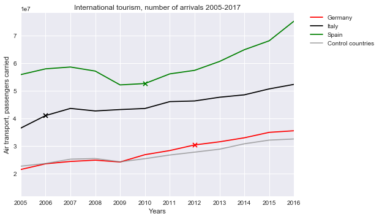

```
import matplotlib.pyplot as plt
import pandas as pd
import numpy as np
```


```
# Read World Happiness Report into pandas
arrivals= "Data/Arrivals.csv"
arrivals_df = pd.read_csv(arrivals)

arrivals_df.head()
```


<div>
<style scoped>
    .dataframe tbody tr th:only-of-type {
        vertical-align: middle;
    }

    .dataframe tbody tr th {
        vertical-align: top;
    }

    .dataframe thead th {
        text-align: right;
    }
</style>
<table border="1" class="dataframe">
  <thead>
    <tr style="text-align: right;">
      <th></th>
      <th>Country Name</th>
      <th>Country Code</th>
      <th>Indicator Name</th>
      <th>Indicator Code</th>
      <th>1960</th>
      <th>1961</th>
      <th>1962</th>
      <th>1963</th>
      <th>1964</th>
      <th>1965</th>
      <th>...</th>
      <th>2008</th>
      <th>2009</th>
      <th>2010</th>
      <th>2011</th>
      <th>2012</th>
      <th>2013</th>
      <th>2014</th>
      <th>2015</th>
      <th>2016</th>
      <th>2017</th>
    </tr>
  </thead>
  <tbody>
    <tr>
      <th>0</th>
      <td>Aruba</td>
      <td>ABW</td>
      <td>International tourism, number of arrivals</td>
      <td>ST.INT.ARVL</td>
      <td>NaN</td>
      <td>NaN</td>
      <td>NaN</td>
      <td>NaN</td>
      <td>NaN</td>
      <td>NaN</td>
      <td>...</td>
      <td>827000.0</td>
      <td>813000.0</td>
      <td>824000.0</td>
      <td>869000.0</td>
      <td>904000.0</td>
      <td>979000.0</td>
      <td>1072000.0</td>
      <td>1225000.0</td>
      <td>1102000.0</td>
      <td>NaN</td>
    </tr>
    <tr>
      <th>1</th>
      <td>Afghanistan</td>
      <td>AFG</td>
      <td>International tourism, number of arrivals</td>
      <td>ST.INT.ARVL</td>
      <td>NaN</td>
      <td>NaN</td>
      <td>NaN</td>
      <td>NaN</td>
      <td>NaN</td>
      <td>NaN</td>
      <td>...</td>
      <td>NaN</td>
      <td>NaN</td>
      <td>NaN</td>
      <td>NaN</td>
      <td>NaN</td>
      <td>NaN</td>
      <td>NaN</td>
      <td>NaN</td>
      <td>NaN</td>
      <td>NaN</td>
    </tr>
    <tr>
      <th>2</th>
      <td>Angola</td>
      <td>AGO</td>
      <td>International tourism, number of arrivals</td>
      <td>ST.INT.ARVL</td>
      <td>NaN</td>
      <td>NaN</td>
      <td>NaN</td>
      <td>NaN</td>
      <td>NaN</td>
      <td>NaN</td>
      <td>...</td>
      <td>294000.0</td>
      <td>366000.0</td>
      <td>425000.0</td>
      <td>481000.0</td>
      <td>528000.0</td>
      <td>650000.0</td>
      <td>595000.0</td>
      <td>592000.0</td>
      <td>397000.0</td>
      <td>NaN</td>
    </tr>
    <tr>
      <th>3</th>
      <td>Albania</td>
      <td>ALB</td>
      <td>International tourism, number of arrivals</td>
      <td>ST.INT.ARVL</td>
      <td>NaN</td>
      <td>NaN</td>
      <td>NaN</td>
      <td>NaN</td>
      <td>NaN</td>
      <td>NaN</td>
      <td>...</td>
      <td>1247000.0</td>
      <td>1711000.0</td>
      <td>2191000.0</td>
      <td>2469000.0</td>
      <td>3156000.0</td>
      <td>2857000.0</td>
      <td>3341000.0</td>
      <td>3784000.0</td>
      <td>4070000.0</td>
      <td>NaN</td>
    </tr>
    <tr>
      <th>4</th>
      <td>Andorra</td>
      <td>AND</td>
      <td>International tourism, number of arrivals</td>
      <td>ST.INT.ARVL</td>
      <td>NaN</td>
      <td>NaN</td>
      <td>NaN</td>
      <td>NaN</td>
      <td>NaN</td>
      <td>NaN</td>
      <td>...</td>
      <td>2059000.0</td>
      <td>1830000.0</td>
      <td>1808000.0</td>
      <td>2242000.0</td>
      <td>2238000.0</td>
      <td>2328000.0</td>
      <td>2363000.0</td>
      <td>2663000.0</td>
      <td>2831000.0</td>
      <td>NaN</td>
    </tr>
  </tbody>
</table>
<p>5 rows × 62 columns</p>
</div>


```
# Create dataframe for winning countries
arrivals_winners_df = arrivals_df.loc[(arrivals_df["Country Name"] == "Spain")|(arrivals_df["Country Name"] == "Italy") | (arrivals_df["Country Name"] == "Germany")]

# Set the 'Country name' to be our index for easy referencing of rows and drop colmns we dont need
arrivals_winners_df = arrivals_winners_df.set_index("Country Name")
arrivals_winners_df.drop([ 'Country Code', 'Indicator Name', 'Indicator Code'], axis=1, inplace=True)

# create on dataframe for control countries
#missing data for sweden, Belgium brought down the mean too much

arrivals_Control_df = arrivals_df.loc[arrivals_df["Country Name"].isin(['Australia','Canada','China','France','India','Indonesia','Japan','Korea, Rep.','Mexico','Netherlands','Russian Federation','Saudi Arabia','Switzerland','Turkey','United Kingdom','United States'])
]
#arrivals_Control_df = arrivals_df.loc[(arrivals_df["Country Name"] == "UK") | (arrivals_df["Country Name"] == "France") | (arrivals_df["Country Name"] == "Brazil") ]
arrivals_Control_df = arrivals_Control_df.set_index("Country Name")

# Set the 'Country name' to be our index for easy referencing of rows and drop colmns we dont need
arrivals_Control_df.drop([ 'Country Code', 'Indicator Name', 'Indicator Code'], axis=1, inplace=True)
arrivals_Control_df.head()

# find the average of arrivals between control countries
mean=arrivals_Control_df.mean(axis=0)


#arrivals_winners_df.loc['Germany'].keys()[50]

```


```
# Collect the years where data was collected
keys = arrivals_Control_df.mean()
years = arrivals_Control_df.keys()
years
```


    Index(['1960', '1961', '1962', '1963', '1964', '1965', '1966', '1967', '1968',
           '1969', '1970', '1971', '1972', '1973', '1974', '1975', '1976', '1977',
           '1978', '1979', '1980', '1981', '1982', '1983', '1984', '1985', '1986',
           '1987', '1988', '1989', '1990', '1991', '1992', '1993', '1994', '1995',
           '1996', '1997', '1998', '1999', '2000', '2001', '2002', '2003', '2004',
           '2005', '2006', '2007', '2008', '2009', '2010', '2011', '2012', '2013',
           '2014', '2015', '2016', '2017'],
          dtype='object')


```

# Plot the number of arrivals for each country and add marker X for the winning year
plt.plot(years, arrivals_winners_df.loc['Germany', years], 
         color="red", label="Germany")
plt.scatter( (arrivals_winners_df.loc['Germany'].keys()[52]),arrivals_winners_df.loc['Germany', '2012'],  color="red",marker='x',label='_nolegend_')


plt.plot(years, arrivals_winners_df.loc['Italy', years], 
         color="black", label="Italy")
plt.scatter( (arrivals_winners_df.loc['Italy'].keys()[46]),arrivals_winners_df.loc['Italy', '2006'],  color="black",marker='x',label='_nolegend_')


plt.plot(years, arrivals_winners_df.loc['Spain', years], 
         color="green", label="Spain")
plt.scatter( (arrivals_winners_df.loc['Italy'].keys()[50]),arrivals_winners_df.loc['Spain', '2010'],  color="green",marker='x',label='_nolegend_')

## plot graph for average of control countries
plt.plot(years, mean, color='grey',alpha=0.65, label="Control countries ")

# Only show years 2005-2016
plt.xlim(2005, 2016)

## create Legend and place outside of graph
plt.legend(bbox_to_anchor=(1.05, 1), loc=2, borderaxespad=0.)

plt.title("International tourism, number of arrivals 2005-2017")
plt.xlabel("Years")
plt.ylabel("Air transport, passengers carried")

# Customize the grid
plt.style.use('seaborn')

# Show the chart
plt.show()
```




